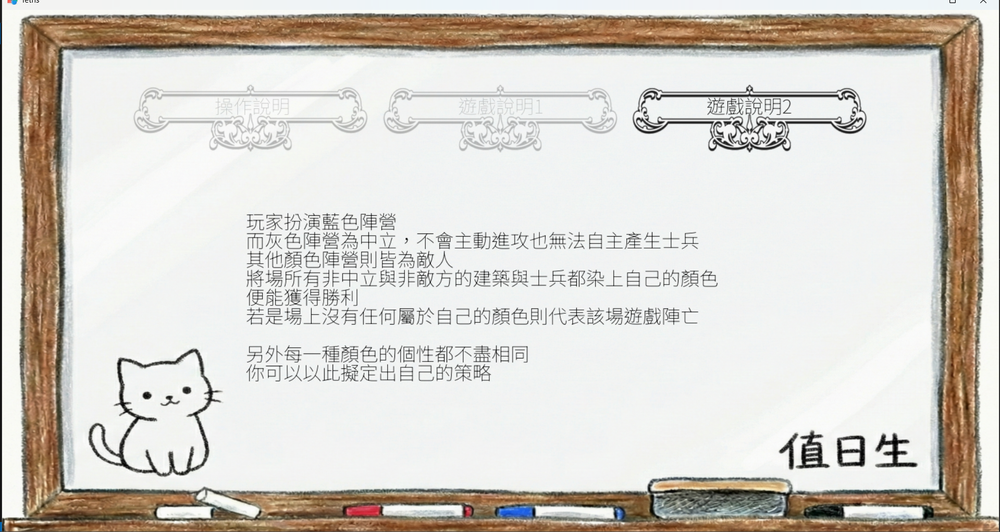
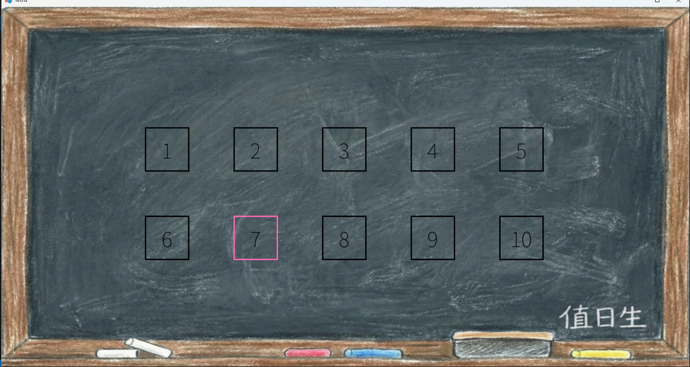
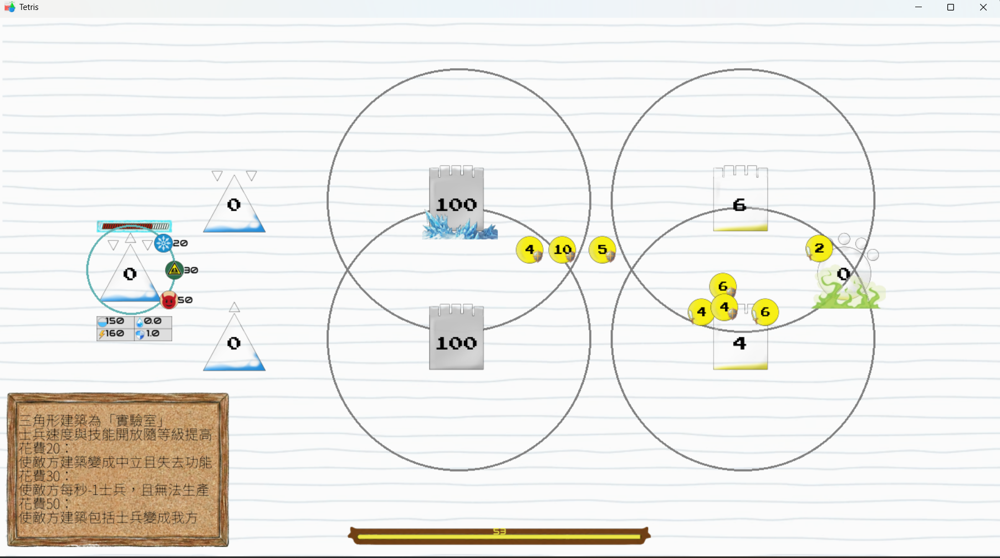
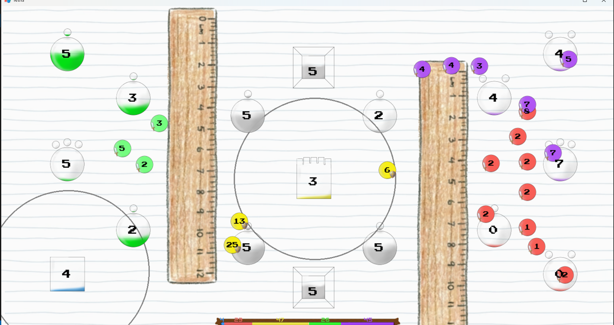
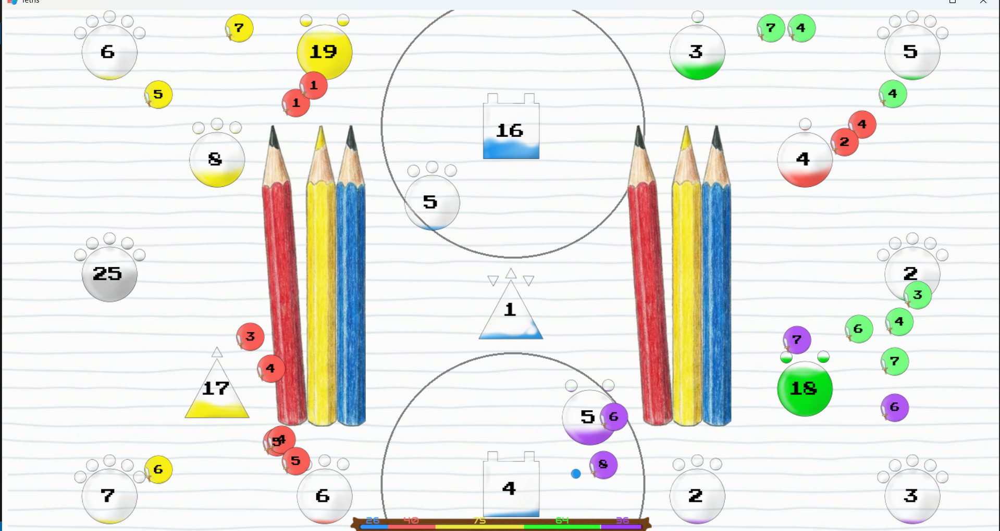

# 俄羅斯方塊（Tetris）遊戲專案

此專題為作者於自學 **Python 、 AI 與 C 進行偕同運作** 時所開發的一個完整塔防策略遊戲。
專案重點在於 **底層遊戲引擎架構的實現** 與 **系統模組化設計**，主要特色如下：

- 網格化建造系統：自定義防禦塔位置與策略佈局
- 所見即所得 (WYSIWYG) 互動系統：解決 UI 遮擋與點擊穿透問題
- 資料驅動設計 (Data-Driven)：UI 佈局與文字內容皆由 JSON 動態載入
- 模組化資源管線：自動化 Sprite 切割、圖片變換與快取管理
- 分層渲染架構：基於 Z-Index 的渲染隊列管理
- 除錯輸出工具（dbg）、頁面狀態管理（PageStateManager）

---

## 📂 目錄結構（主要檔案 / 模組概覽）

```text

Geometry War/
├── background/             # 遊戲背景圖片資源
├── core/                   # 核心程式碼庫
│   ├── c_inc/              # C 語言標頭檔 (Headers)
│   ├── c_src/              # C 語言原始碼
│   │   └── a_star/         # 高效能 A* 路徑搜尋演算法實作
│   ├── dll/                # 編譯完成的動態連結庫 (a_star.dll)
│   ├── py/                 # Python 模組與管理器
│   │   ├── a_star/         # Python 對 C DLL 的介接層 (ctypes wrapper)
│   │   ├── font/           # 字型管理器 (FontManager)
│   │   ├── game/           # 遊戲核心邏輯 (Building, Enemy, Tower)
│   │   ├── hmi/            # 人機介面 (Human-Machine Interface)
│   │   ├── input/          # 輸入處理 (Mouse, Keyboard)
│   │   ├── json/           # JSON 設定檔讀取與解析
│   │   ├── page/           # 頁面狀態機與導航 (PageStateManager)
│   │   ├── path/           # 路徑管理與運算
│   │   ├── rendering/      # 渲染核心 (RenderProxy, RenderManager)
│   │   ├── resource/       # 資源載入器
│   │   ├── screen/         # 螢幕顯示管理 (ImgManager, DrawManager)
│   │   ├── trans/          # 轉場效果處理
│   │   ├── ui_layout/      # UI 佈局系統 (LayoutManager)
│   │   ├── compile_dll.py  # C 語言自動編譯腳本
│   │   └── ...             # 基礎模組 (base, debug, variable, interrupt 等)
│   └── game_main.py        # Python 原始碼進入點 (Entry Point)
├── data/                   # 遊戲數值與設定資料 (JSON)
├── font/                   # 字體檔案 (.ttf, .otf)
├── img/                    # 遊戲 Sprite 圖片素材
├── screenshot/             # README 展示用截圖
├── song/                   # 音效與背景音樂資源
├── game_main.exe           # 已打包的可執行檔 (Windows Build)
├── images.ico              # 程式圖示
└── README.md               # 專案說明文件

```


# 🎮 主要功能

## 塔防戰鬥機制
- 網格建造：玩家需在有限的地圖網格上，策略性地配置防禦塔。
- 敵人 AI：敵人會根據路徑動態移動，並具備不同的屬性（速度、血量）。
- 資源管理：透過擊敗敵人或建造生產單位獲取資源，用於升級或建造更多防禦。

# ⚙️ 核心特性
- 混合語言架構 (Hybrid Architecture)：Python 負責邏輯與渲染，C 語言負責密集運算 (A*)。
- 資料驅動 (Data-Driven)：UI 佈局、文字內容、關卡設定皆由 JSON 動態載入。
- 所見即所得 (WYSIWYG)：解決 UI 遮擋與點擊穿透問題的互動系統。

# 💡 技術亮點 (Technical Highlights)
1. Python/C 混合編程 (C Extensions)
為了突破 Python 在大量迴圈運算上的效能瓶頸，本專案將 A (A-Star) 路徑搜尋演算法* 使用 C 語言重寫。

原始碼：位於 core/c_src/a_star/

整合方式：編譯為 core/dll/a_star.dll，並透過 ctypes 與 Python 介接。

效益：大幅提升了敵人尋路與大量單位移動的運算效率。

2. 渲染代理 (Render Proxy) - 解決點擊穿透
實作 Render-as-Registration (渲染即註冊) 機制解決 UI 互動問題：

機制：每一幀繪製時，物件將自身的 Collision Rect 與 Z-Index 註冊到 RenderProxy。

判定：點擊時，代理器反向遍歷（Reversed Z-Order）判定最上層物件。

結果：徹底根除「點擊到被遮擋物件」的 Bug，實現精確的滑鼠互動。

3. 自動化資源管線
ImgManager：實作 Sprite Sheet 自動切割、圖片動態變換 (Scale/Rotate) 與雜湊快取 (Hash Caching)。

FontManager：支援多語言 JSON 對照與排版渲染。

---

# ⌨️ 操作說明（預設鍵位）
1. 滑鼠左鍵：
- 選擇單位 / 建造塔樓。
- 點擊 UI 按鈕。

2. 滑鼠右鍵：
- 取消選擇 / 移除建築。
- 方向鍵：設定選項或選取移動。

3. BackSpace
- 返回上一頁。

4. Enter
- 確認選取

---

# 🚀 如何執行
## 方式一：直接執行 (Windows)
雙擊根目錄下的 game_main.exe 即可直接遊玩，無需安裝 Python 環境。

## 方式二：從原始碼執行 (開發者)
1. 環境需求
Python 3.10+
GCC 編譯器 (若需重新編譯 DLL)

2. 安裝依賴
pip install pygame-ce

3. 執行遊戲
python core/game_main.py

---

# 📝 學習與決策重點
- 模組化：畫面、字型、鍵盤、遊戲邏輯分離，方便除錯與擴充。

- 工程實務：資源路徑抽象、JSON 設定與持久化。

- 演算法：碰撞、旋轉、消行、combo、攻擊轉換與垃圾列生成。

- 學習取向：涵蓋遊戲開發常見面向（事件循環、狀態機、資料管理）。


# 🖼️ 截圖展示








